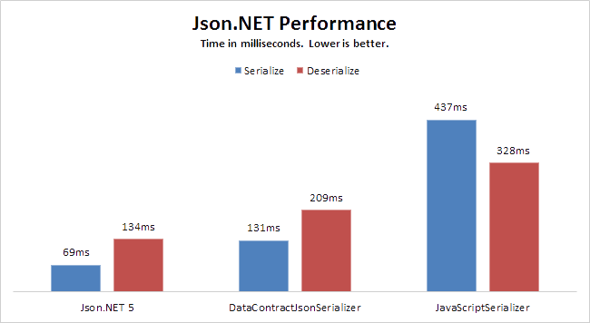

# C\#

## Notes
1. 匿名类 <br/> 方便 json序列化
    ```
    var class = new
    {
        attribute1 = "string",
        attribute2 = int,
        attribute3 = new { attribute = "string" }
    };
    ```
2. json 序列化与反序列化 <br />
    现**不推荐**此种，**强烈建议使用Newtonsoft.Json**
    ```
    序列化
    JavaScriptSerializer jsonSerialize = new JavaScriptSerializer();
    string json = jsonSerialize.Serialize(object);
    反序列化
    JavaScriptSerializer jsonSerialize = new JavaScriptSerializer();
    var object = jsonSerialize.Deserialize<objectclass>(jsonString);
    ```
    **强烈建议使用如下**
    
    ```
    using Newtonsoft.Json;
    序列化
    string json = JsonConvert.SerializeObject(object);
    反序列化
    public static T Deserialize<T>(string json)
    {
        JsonSerializer m_json = new JsonSerializer();
        m_json.NullValueHandling = NullValueHandling.Ignore;
        m_json.ObjectCreationHandling = ObjectCreationHandling.Replace;
        m_json.MissingMemberHandling = MissingMemberHandling.Ignore;
        m_json.ReferenceLoopHandling = ReferenceLoopHandling.Ignore;
        StringReader sr = new StringReader(json);
        JsonTextReader reader = new JsonTextReader(sr);
        object result = m_json.Deserialize(reader, typeof(T));
        reader.Close();
        return (T)result;
    }
    ```
3. `${}`字符串格式 - 语法糖 <br/>
    字符串前面加$符号后，字符串里{}内就可以写程序范围内的变量
    ```
    string id = "110";
    string query = $"select * from table where id={id}";
    ```
